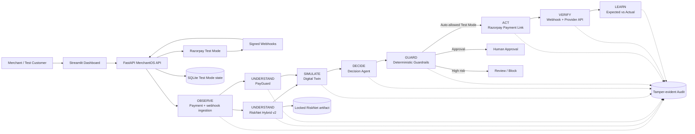

# MerchantOS AI v1.4.1 Architecture

## Runtime boundaries

- **Razorpay** remains the payment provider. MerchantOS does not replace the gateway.
- **FastAPI** owns provider integration, model scoring, decisions, guardrails, actions, verification, and persistence.
- **Streamlit** is a presentation/client layer and never accesses SQLite directly.
- **RiskNet** provides evidence only. It cannot call Razorpay actions.
- **Guardrails** are deterministic and own the provider-action boundary.
- **Docker Compose** places API and dashboard on an internal network while exposing only ports 8000 and 8501 to the host.
